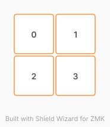

# ZMK Configuration for test_kb

*Generated by Shield Wizard for ZMK*



Download compiled firmware from the Actions tab. <https://zmk.dev/docs/user-setup#installing-the-firmware>

Edit your keymap <https://zmk.dev/docs/keymaps>.
User keymap is located at [`config/test_kb.keymap`](config/test_kb.keymap).

-----

<details>
<summary>
Shield Wizard Debug Information
</summary>

In case of broken configuration, here is the Shield Wizard internal data used to generate this configuration:

Commit: 91406f4c7cfc67b0f2b2639a4d61044ae69c7e60

```json
{"name":"test_kb","shield":"test_kb","dongle":false,"modules":[],"layout":[{"id":"01KZ7K22TN976VHDEC314V7M64","part":0,"row":0,"col":0,"w":1,"h":1,"x":0,"y":0,"r":0,"rx":0,"ry":0},{"id":"01KZ7K2439RKFGJJTVQHVANQYR","part":0,"row":0,"col":1,"w":1,"h":1,"x":1,"y":0,"r":0,"rx":0,"ry":0},{"id":"01KZ7K24BS8QMNKDE4TQVGB883","part":0,"row":1,"col":0,"w":1,"h":1,"x":0,"y":1,"r":0,"rx":0,"ry":0},{"id":"01KZ7K24Q5XC2M4GBNY0YXH8HY","part":0,"row":1,"col":1,"w":1,"h":1,"x":1,"y":1,"r":0,"rx":0,"ry":0}],"parts":[{"name":"unibody","controller":"nice_nano_v2","pins":{"d2":{"usage":"kscan","kscan":"01KZ7K9VX5Z9NF6AXQX3RX2HK4","role":"input"},"d3":{"usage":"kscan","kscan":"01KZ7K9VX5Z9NF6AXQX3RX2HK4","role":"input"},"d21":{"usage":"kscan","kscan":"01KZ7K9VX5Z9NF6AXQX3RX2HK4","role":"output"},"d20":{"usage":"kscan","kscan":"01KZ7K9VX5Z9NF6AXQX3RX2HK4","role":"output"}},"kscans":[{"kind":"matrix","id":"01KZ7K9VX5Z9NF6AXQX3RX2HK4","diodes":true}],"keys":{"01KZ7K2439RKFGJJTVQHVANQYR":{"input":"d3","output":"d20"},"01KZ7K22TN976VHDEC314V7M64":{"input":"d2","output":"d20"},"01KZ7K24BS8QMNKDE4TQVGB883":{"input":"d2","output":"d21"},"01KZ7K24Q5XC2M4GBNY0YXH8HY":{"input":"d3","output":"d21"}},"encoders":[],"buses":{}}]}
```

</details>
